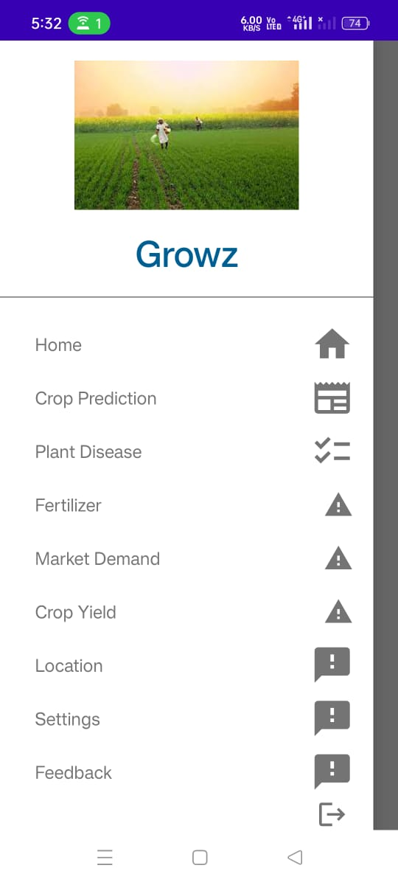
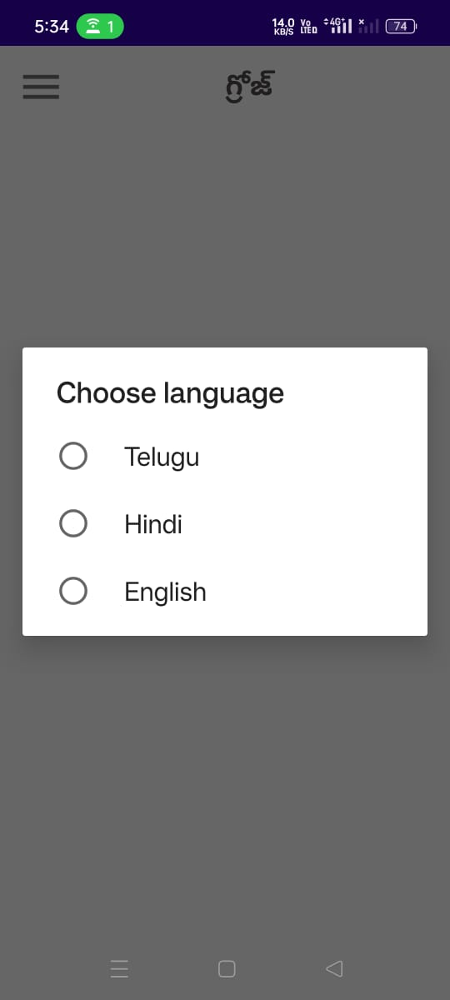
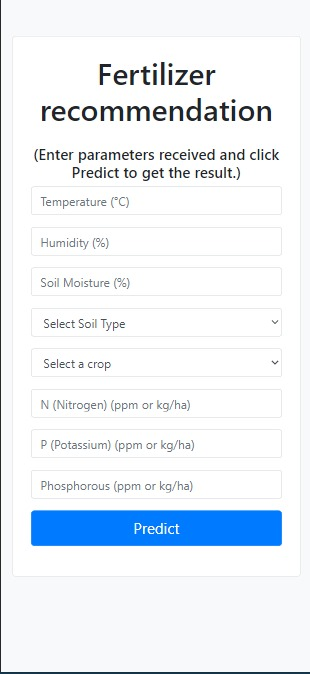
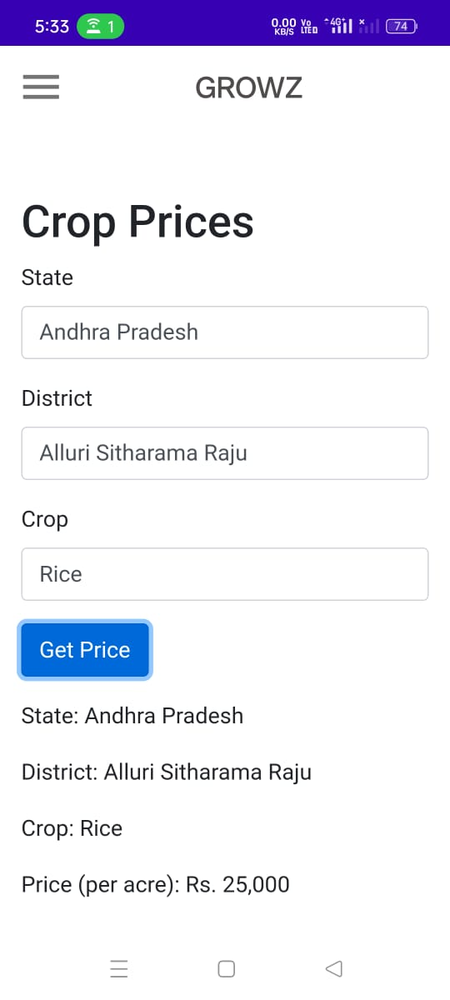
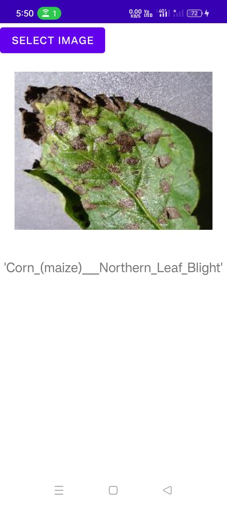

# Growz Application

Welcome to Growz, your comprehensive solution for modern agriculture needs. This README file will guide you through the main features of our application, providing visual aids and descriptions for a better understanding.

## Table of Contents

1. [Login Page](#login-page)
2. [Create Account Page](#create-account-page)
3. [Side Navigation Bar](#side-navigation-bar)
4. [Language Feature](#language-feature)
5. [Fertilizer Recommendation](#fertilizer-recommendation)
6. [Location Recommendation](#location-recommendation)
7. [Crop Yield Prediction](#crop-yield-prediction)
8. [Plant Disease Prediction](#plant-disease-prediction)

## Login Page

The login page is the gateway to accessing the Growz application. Here users can enter their credentials to log in.

## Create Account Page

New users can create an account using this page. It includes fields for essential information and preferences.

## Side Navigation Bar

The side navigation bar provides easy access to all main features of the application. It includes links to:

- Home
- Fertilizer Recommendation
- Location Recommendation
- Crop Yield Prediction
- Plant Disease Prediction
- Settings

## Language Feature

Growz supports multiple languages to cater to a diverse user base. Users can select their preferred language from the settings.

## Fertilizer Recommendation

This feature provides customized fertilizer recommendations based on soil type, crop type, and other environmental factors.

## Location Recommendation

Based on climate, soil, and water availability, this feature suggests the best locations for planting specific crops.

## Crop Yield Prediction

Using advanced machine learning algorithms, this feature predicts the yield for various crops based on current and historical data.

## Plant Disease Prediction

Upload images of your crops, and this feature will diagnose potential diseases and suggest treatments.

## Getting Started

1. **Install the application**: Download the app from the official website or app store.
2. **Create an account**: Use the create account page to register.
3. **Log in**: Enter your credentials on the login page.
4. **Explore features**: Use the side navigation bar to explore all features.

For more detailed information, refer to the user manual or visit our [official website](https://www.Growz.com).

## Support

For support, contact us at support@Growz.com or visit our [support page](https://www.Growz.com/support).

Thank you for choosing Growz! Your partner in modern agriculture.
